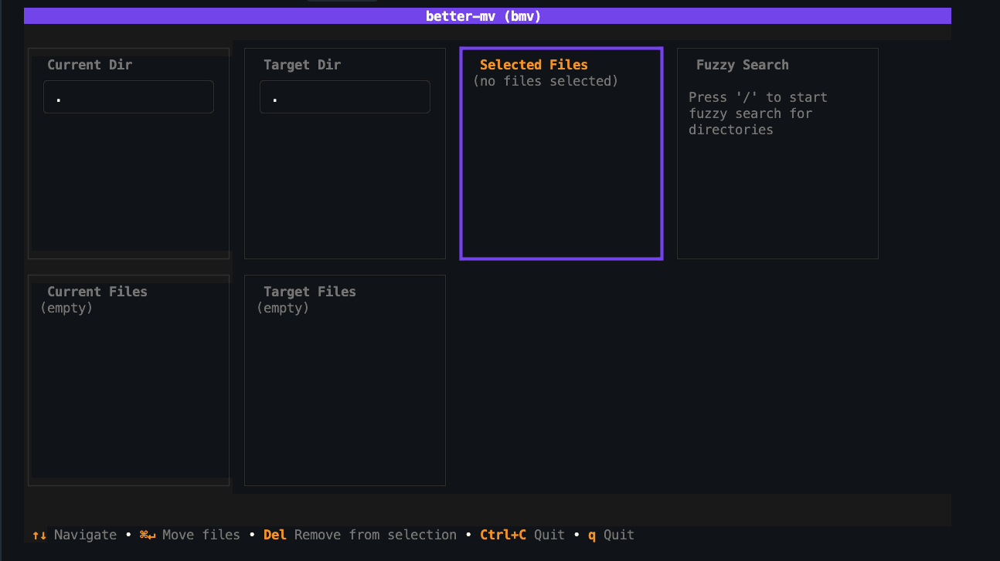

# tuimv - File Movement Tool

> [日本語版はこちら](README_ja.md) / [Japanese version is here](README_ja.md)

****It's not working right now because it's WIP**
tuimv is a terminal-based file movement tool that provides an intuitive UI and efficient file operations.

## Overview

tuimv is a file management tool built using Bubble Tea (Go's TUI framework) with a 6-panel layout. Users can select files from the current directory and move them to a target directory.





## Architecture

### Package Structure

```
better-mv/
├── cmd/bmv/           # Main entry point
├── internal/
│   ├── model/         # Data models and application state
│   └── ui/            # User interface and TUI logic
└── specifications/     # Project specifications
```

### Core Components

#### 1. Application State Management (`internal/model/`)

- **`AppState`**: Manages the overall application state
- **`PanelType`**: Defines the 6 panel types
- **`AppMode`**: Application operation mode (normal, search, move)
- **`FileInfo`**: File information structure
- **`DirectoryInfo`**: Directory information structure

#### 2. User Interface (`internal/ui/`)

- **`Model`**: Main UI model and state management
- **`View`**: Screen rendering logic
- **`Keybindings`**: Keyboard input processing
- **`Messages`**: Custom message types
- **`Styles`**: UI styling

## Panel Layout

The application consists of 6 panels:

```
┌─────────────────┬─────────────────┬─────────────────┬─────────────────┐
│ Panel 1:       │ Panel 3:       │ Panel 5:       │ Panel 6:       │
│ Current Dir    │ Target Dir      │ Selected Files │ Fuzzy Search   │
│ Input          │ Input           │ List           │ Results        │
├─────────────────┼─────────────────┼─────────────────┼─────────────────┤
│ Panel 2:       │ Panel 4:       │                 │                 │
│ Current Files  │ Target Files    │                 │                 │
│ List           │ List            │                 │                 │
└─────────────────┴─────────────────┴─────────────────┴─────────────────┘
```

### Panel Details

1. **Current Directory Input** - Current directory path input
2. **Current Files List** - List of files in current directory
3. **Target Directory Input** - Target directory path input
4. **Target Files List** - List of files in target directory
5. **Selected Files List** - List of files selected for movement
6. **Fuzzy Search Results** - Directory search results

## Operation Flow

### 1. Application Startup

```go
func main() {
    m := ui.NewModel()           // Initialize UI model
    p := tea.NewProgram(m)       // Create Bubble Tea program
    p.Run()                      // Execute program
}
```

### 2. Model Initialization

```go
func NewModel() *Model {
    state := model.NewAppState()  // Initialize application state
    
    // Initialize each UI component
    currentDirInput := NewShortTextInput(...)
    targetDirInput := NewShortTextInput(...)
    // ... other components
    
    return &Model{...}
}
```

### 3. Event Processing

The application handles the following message types:

- **`tea.WindowSizeMsg`**: Window size changes
- **`tea.KeyMsg`**: Keyboard input
- **`PanelSwitchMsg`**: Panel switching
- **`FileSelectedMsg`**: File selection
- **`DirectoryChangedMsg`**: Directory changes
- **`SearchQueryChangedMsg`**: Search query changes

### 4. Panel Navigation

Users can navigate between panels using:

- **Vim-style**: `h`, `j`, `k`, `l` keys
- **Tab navigation**: `Tab`, `Shift+Tab`
- **Direct specification**: Custom messages

```go
func (m *Model) getPanelToLeft() model.PanelType {
    switch m.state.ActivePanel {
    case model.TargetDirInput:
        return model.CurrentDirInput
    case model.TargetFilesList:
        return model.CurrentFilesList
    // ... other cases
    }
}
```

### 5. File Operations

#### File Selection
```go
func (m Model) handleFileSelectedMsg(msg FileSelectedMsg) (tea.Model, tea.Cmd) {
    // Check if file is already selected
    for _, selected := range m.state.SelectedFiles {
        if selected.AbsPath == msg.File.AbsPath {
            return m, nil // Already selected
        }
    }
    
    // Add file to selected list
    msg.File.IsSelected = true
    m.state.SelectedFiles = append(m.state.SelectedFiles, *msg.File)
    
    return m, nil
}
```

#### Directory Changes
```go
func (m Model) handleDirectoryChangedMsg(msg DirectoryChangedMsg) (tea.Model, tea.Cmd) {
    if msg.IsTarget {
        m.state.TargetDir = msg.Path
        m.targetDirInput.SetValue(msg.Path)
    } else {
        m.state.CurrentDir = msg.Path
        m.currentDirInput.SetValue(msg.Path)
    }
    
    // TODO: Trigger directory scan
    return m, nil
}
```

## Key Bindings

### Global Key Bindings

- **`Ctrl+C` / `q`**: Exit application
- **`Esc`**: Clear search mode, deselect
- **`/`**: Activate search mode

### Navigation

- **`h`, `j`, `k`, `l`**: Vim-style panel movement
- **`Tab`**: Move to next panel
- **`Shift+Tab`**: Move to previous panel

### Panel-Specific Key Bindings

#### File List Panels
- **`↑`, `↓`**: Cursor movement
- **`Space`**: File selection/deselection
- **`Enter`**: Directory navigation

#### Selected Files Panel
- **`Delete` / `Backspace`**: Remove file from selection
- **`Cmd+Enter` / `Ctrl+Enter`**: Execute file movement

## State Management

### AppState Structure

```go
type AppState struct {
    CurrentDir    string            // Current directory path
    TargetDir     string            // Target directory path
    CurrentFiles  []FileInfo        // Files in current directory
    TargetFiles   []FileInfo        // Files in target directory
    SelectedFiles []FileInfo        // Files selected for movement
    SearchResults []DirectoryInfo   // Search results
    SearchQuery   string            // Current search query
    ActivePanel   PanelType         // Currently active panel
    CurrentIndex  map[PanelType]int // Cursor position for each panel
    Mode          AppMode           // Current application mode
    IsSearching   bool              // Search mode state
}
```

### Panel State Tracking

Each panel's cursor position is managed in the `CurrentIndex` map and preserved during panel switches.

## Message System

Uses Bubble Tea's message system for communication between UI components:

```go
// Panel switch message
type PanelSwitchMsg struct {
    Panel model.PanelType
}

// File selection message
type FileSelectedMsg struct {
    File  *model.FileInfo
    Index int
}

// Directory change message
type DirectoryChangedMsg struct {
    Path     string
    IsTarget bool
}
```

## Extensibility

### Adding New Panels

1. Add new constant to `model.PanelType`
2. Add UI component to `Model` struct
3. Implement rendering logic in `View()` function
4. Add key binding processing
5. Update navigation logic

### Adding New Message Types

1. Define new message struct in `messages.go`
2. Implement message handler in `Update()` function
3. Update UI components as needed

## Future Implementation Plans

- [ ] File movement operation implementation
- [ ] Directory scan implementation
- [ ] Error handling and user notifications
- [ ] Configuration file support
- [ ] Plugin system
- [ ] History functionality

## Technology Stack

- **Language**: Go
- **TUI Framework**: Bubble Tea
- **Styling**: Lip Gloss
- **Architecture**: MVC pattern
- **State Management**: Custom state machine

## Development Environment Setup

```bash
# Clone repository
git clone <repository-url>
cd better-mv

# Install dependencies
go mod download

# Run application
go run cmd/bmv/main.go

# Build
go build -o bmv cmd/bmv/main.go
```

## License

This project is published under the MIT License.
