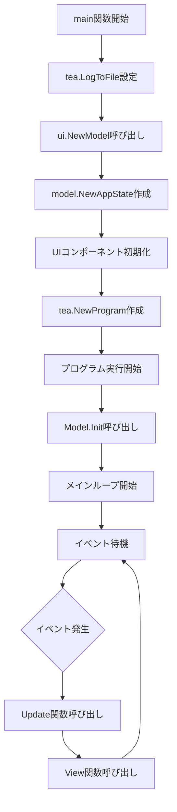
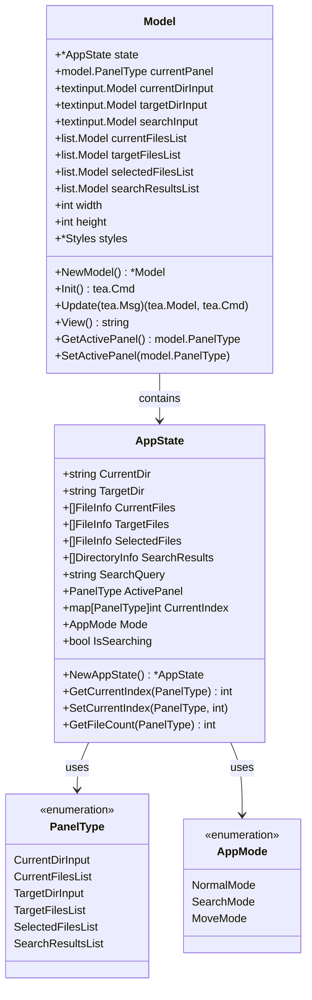
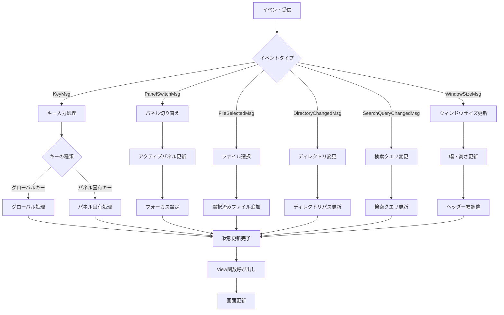
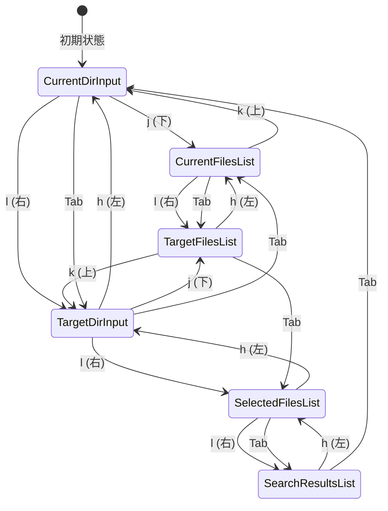
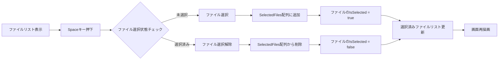
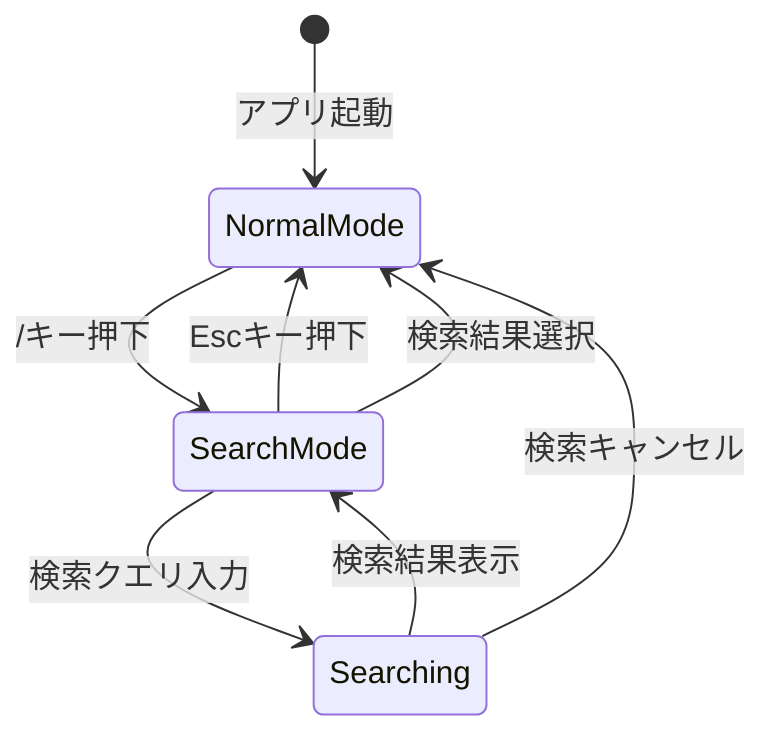
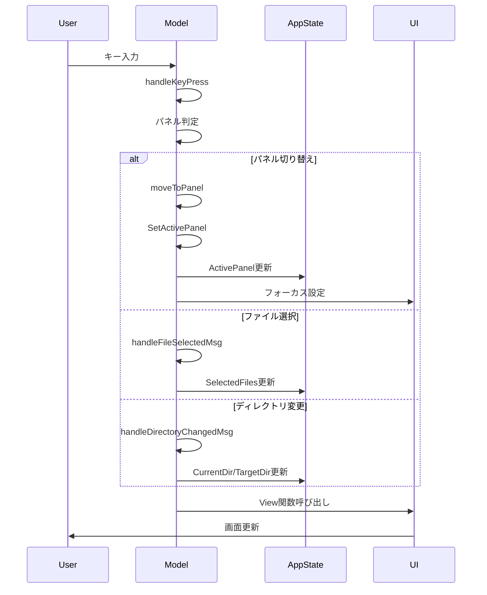
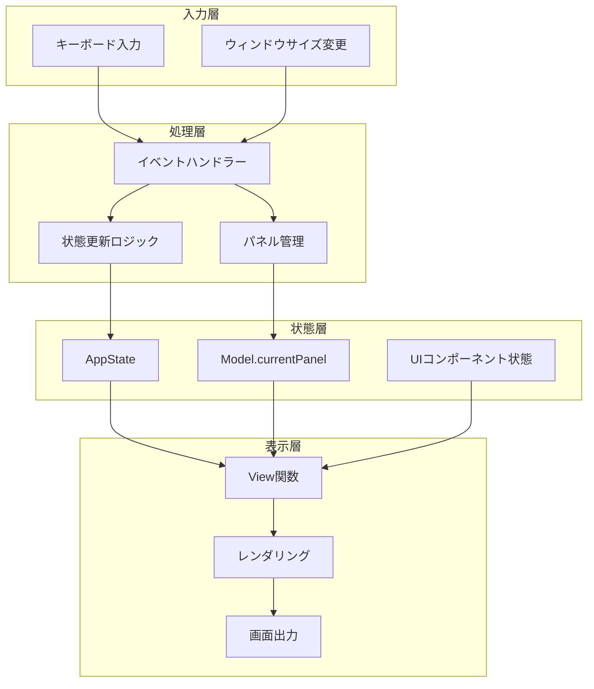
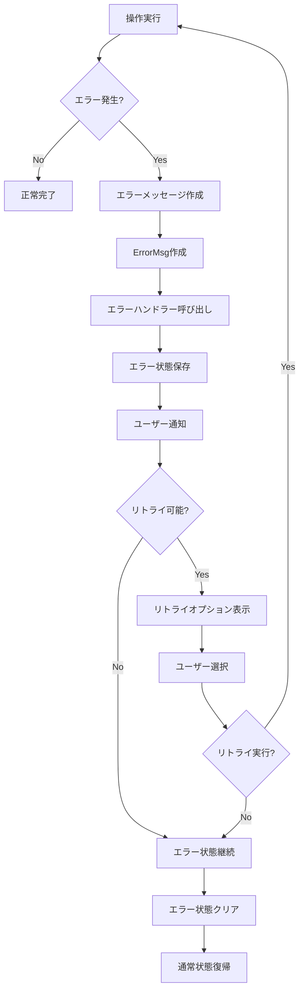
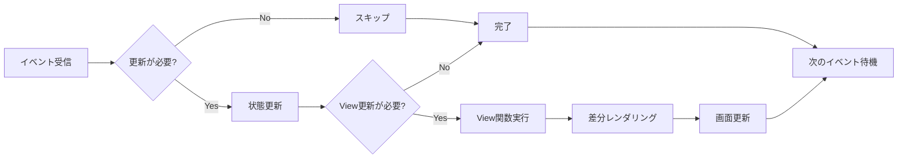

# Better MV - アーキテクチャ図

このドキュメントでは、Better MVの動作フローとstateの変更を図で説明します。

## 1. アプリケーション起動フロー

## 2. 状態管理の構造

## 3. イベント処理フロー

## 4. パネルナビゲーション状態遷移

## 5. ファイル選択状態の変化

## 6. 検索モードの状態遷移

## 7. メッセージの流れ

## 8. データフローの概要

## 9. エラーハンドリングフロー

## 10. パフォーマンス最適化のポイント

これらの図により、Better MVの複雑な状態管理とイベント処理の流れが視覚的に理解できます。各コンポーネントがどのように連携し、状態がどのように変化するかが明確になります。
