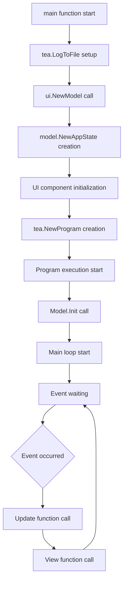
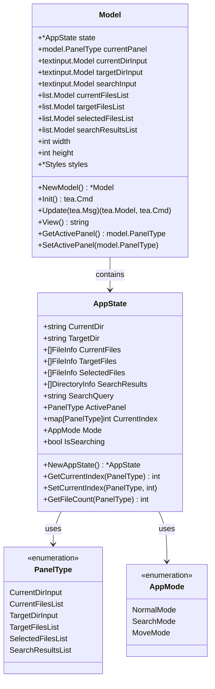
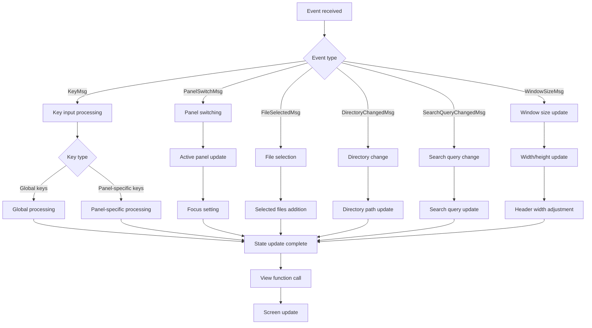
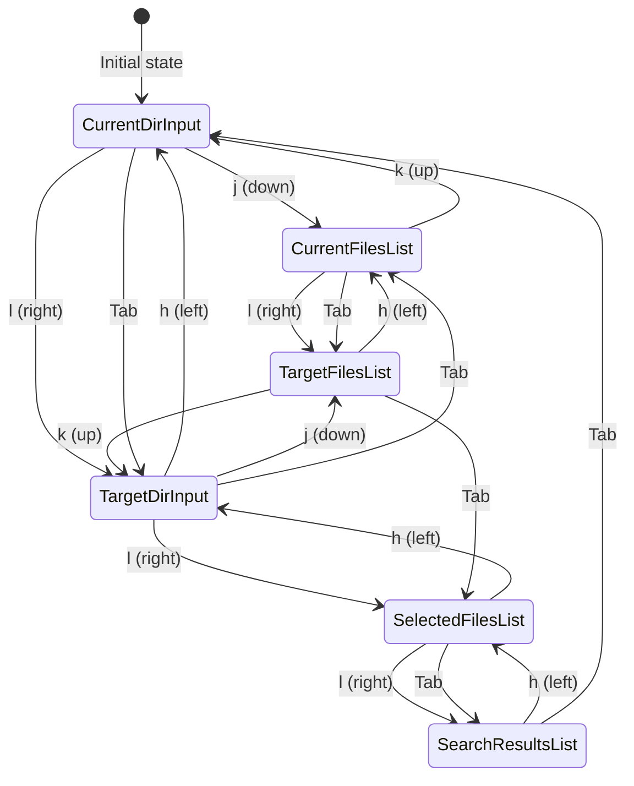
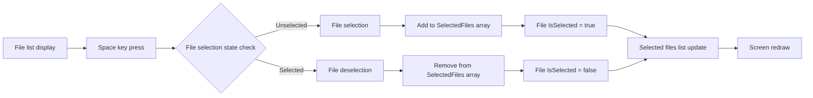
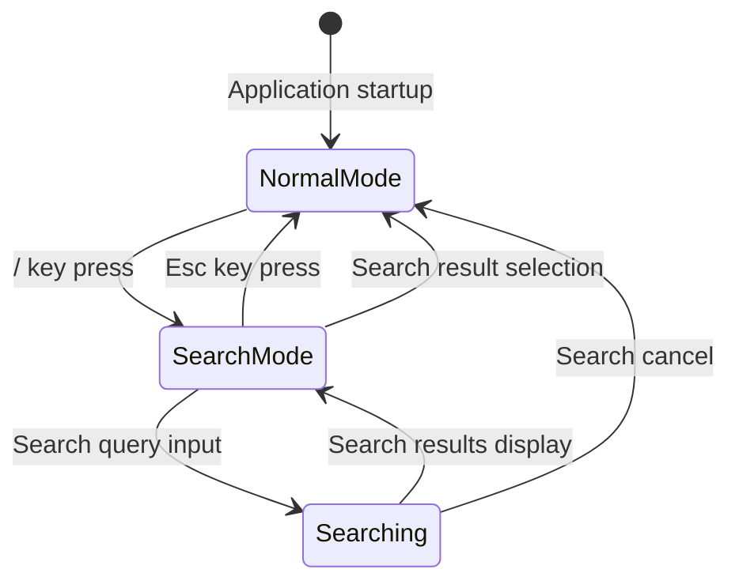
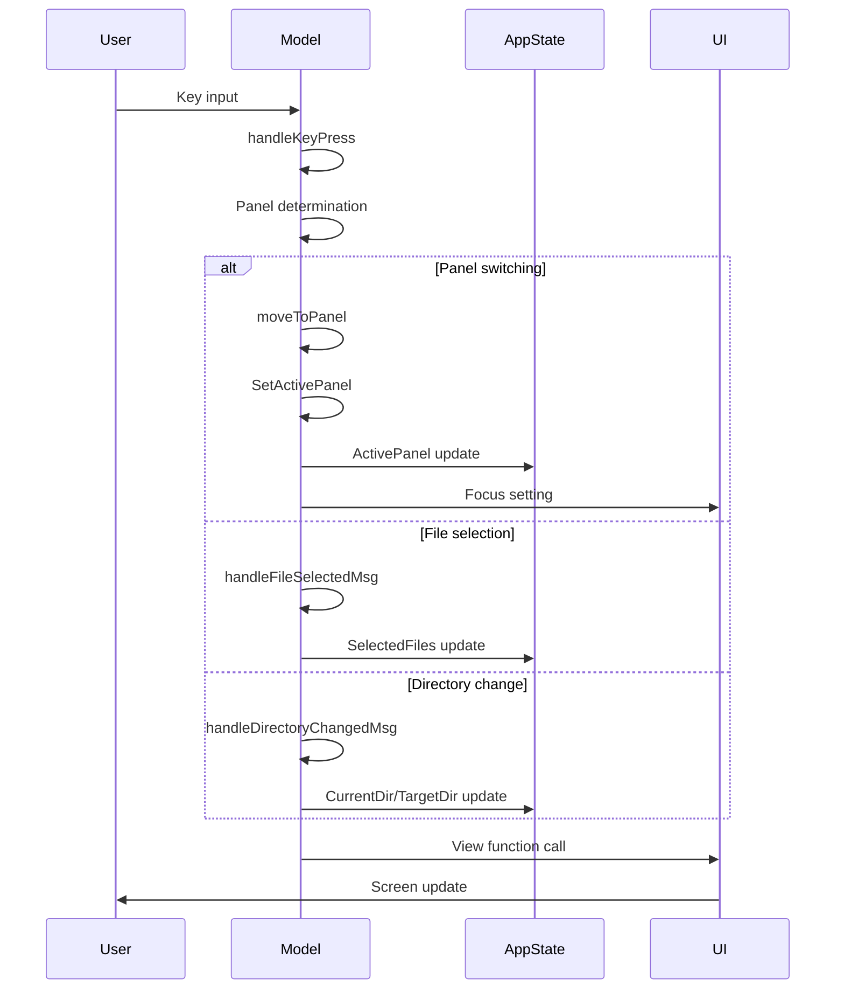
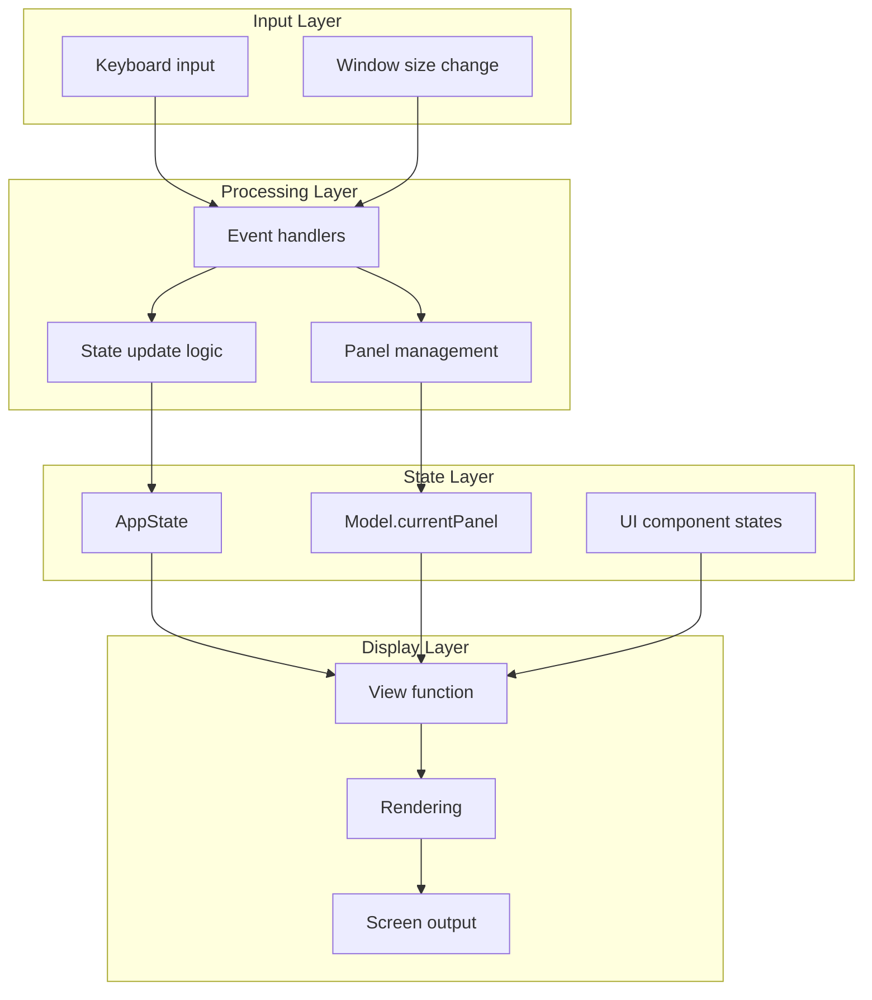
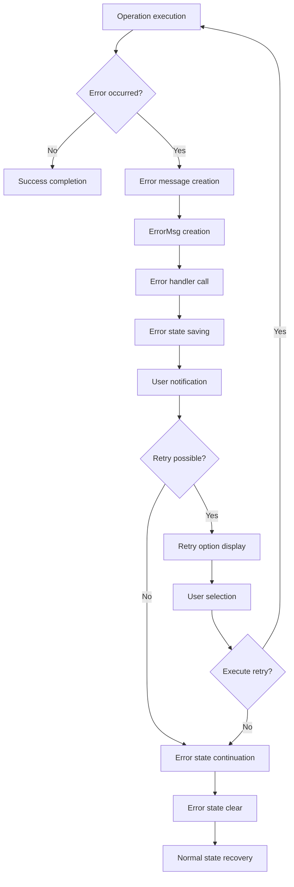
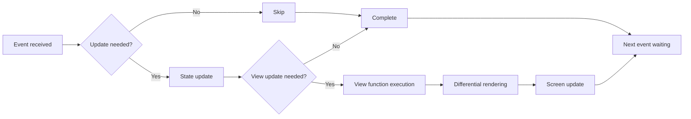

# tuimv - Architecture Diagrams

> [日本語版はこちら](architecture-diagrams_ja.md) / [Japanese version is here](architecture-diagrams_ja.md)

This document explains tuimv's operation flow and state changes using diagrams.

## 1. Application Startup Flow

## 2. State Management Structure

## 3. Event Processing Flow

## 4. Panel Navigation State Transitions

## 5. File Selection State Changes

## 6. Search Mode State Transitions

## 7. Message Flow

## 8. Data Flow Overview

## 9. Error Handling Flow

## 10. Performance Optimization Points

These diagrams provide a visual understanding of tuimv's complex state management and event processing flow. They clearly show how each component collaborates and how states change.
